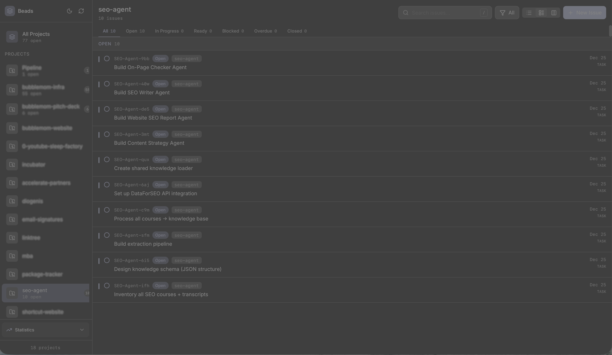
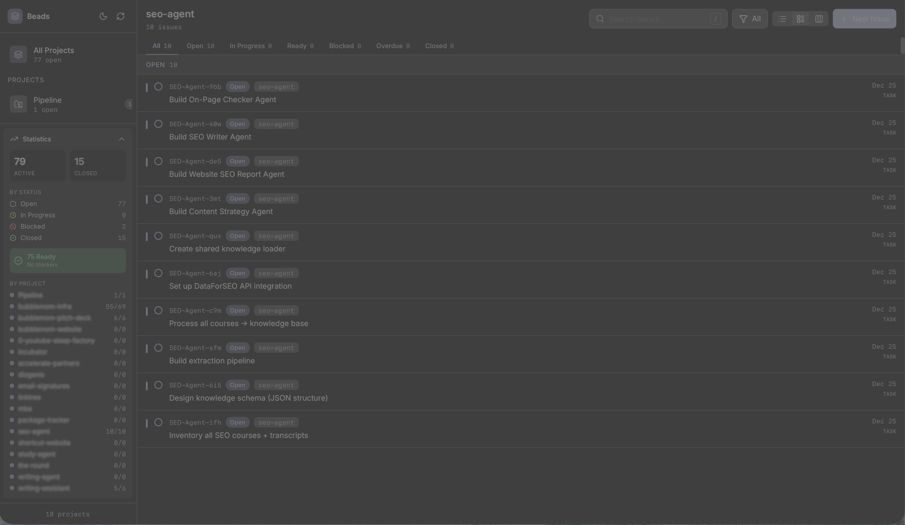
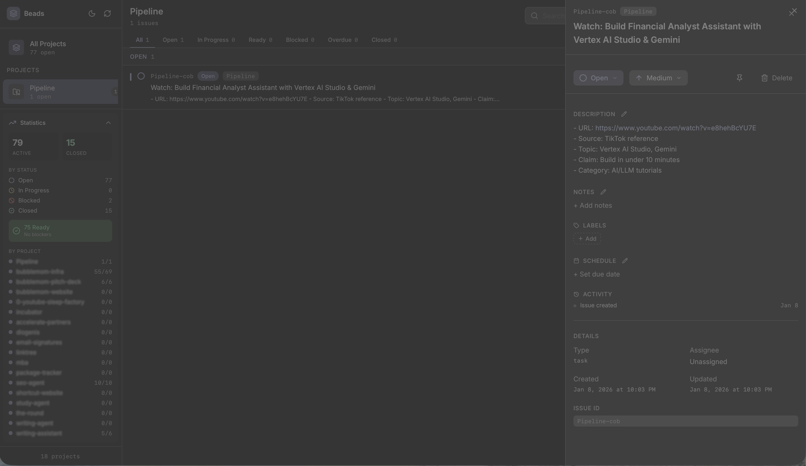

# Beads Dashboard

A web dashboard for [beads](https://github.com/steveyegge/beads), the local-first issue tracker for software projects.



## Features

- Multi-project issue browsing across beads databases
- SQLite-backed project editing and JSONL-backed project browsing
- List and Kanban views
- Inline editing for titles, descriptions, notes, labels, and due dates
- Statistics and project-level summaries
- Keyboard shortcuts for common issue-navigation actions
- WebSocket-based live refresh between the frontend and API server

## Requirements

- Node.js `^20.19.0` or `>=22.12.0`
- npm
- One or more projects that use [beads](https://github.com/steveyegge/beads)

## Installation

Clone the repository from the trusted location you intend to use, then install dependencies:

```bash
git clone <repository-url>
cd beads-dashboard
npm install
```

## Configuration

The API server scans for beads databases starting from `BEADS_ROOT`. If `BEADS_ROOT` is unset, it scans the
current working directory.

| Variable | Description | Default |
| --- | --- | --- |
| `HOST` | Interface for the API server and WebSocket server | `0.0.0.0` |
| `PORT` | API server port | `3001` |
| `BEADS_ROOT` | Root directory to scan for beads projects | current working directory |
| `CORS_ORIGIN` | Comma-separated allowed browser origins | `http://localhost:5173,http://127.0.0.1:5173,http://localhost:4173,http://127.0.0.1:4173` |
| `ALLOWED_HOSTS` | Comma-separated Vite dev-server host allowlist | empty |

Example:

```bash
BEADS_ROOT=/path/to/projects npm run dev:all
```

To allow named hosts such as `devbox` or `devbox.local` in development, set `ALLOWED_HOSTS` in `.env`:

```ini
ALLOWED_HOSTS=devbox,devbox.local
```

### Supported Beads storage

The dashboard recognizes Beads projects by inspecting each project's `.beads/` directory:

- `.beads/*.db` — supported for read and write operations
- `.beads/issues.jsonl` — supported for read-only browsing

JSONL-backed projects can be viewed in the dashboard, but mutations are rejected by the API. If your Beads project
uses Dolt or exports JSONL files from another backend, treat the dashboard as a reader unless the real storage
contract is implemented.

## Usage

Start the frontend and API server together:

```bash
npm run dev:all
```

Or run them separately:

```bash
# Terminal 1
npm run dev:server

# Terminal 2
npm run dev
```

Then open `http://localhost:5173` in your browser.

If you are already inside the directory that contains your Beads projects, you can launch the dashboard repo with
`npm --prefix` while pointing `BEADS_ROOT` at the current folder:

```bash
BEADS_ROOT="$PWD" npm --prefix /path/to/beads-dashboard run dev:all
```

### Remote / LAN development access

The Vite dev server and API server bind to `0.0.0.0` for local network access. In development, the frontend reaches
the backend through Vite proxying for `/api` and `/ws`, so remote browsers should use the dashboard origin instead of
calling `localhost:3001` directly.

If you access the dashboard through a hostname such as `http://devbox:5173`, add that name to `ALLOWED_HOSTS` in
`.env` and restart the dev server. When running through Bun, `.env` is loaded automatically.

## Scripts

| Command | Description |
| --- | --- |
| `npm run dev` | Start the Vite frontend dev server |
| `npm run dev:server` | Start the API server with `tsx watch` |
| `npm run dev:all` | Start both development servers |
| `npm run build` | Build the frontend bundle |
| `npm run lint` | Run ESLint |
| `npm run lint:fix` | Run ESLint with autofix |
| `npm run format` | Format TypeScript source files with Prettier |
| `npm run format:check` | Check TypeScript source formatting |
| `npm run preview` | Preview the frontend production build |

## Screenshots

### Statistics Panel



### Issue Detail



## Development

Validate the repository with:

```bash
npm run lint
npm run build
```

## Troubleshooting

- `ECONNREFUSED 127.0.0.1:3001` in the browser means only the frontend is running. Start `npm run dev:all` or run
  `npm run dev:server` in a second terminal.
- `Found 0 projects` usually means the target directory does not contain a supported `.beads` layout. Check whether
  the project has a `.db` file or only exported JSONL files.
- `Blocked request. This host is not allowed.` comes from Vite host-header protection. Add the hostname you are using
  to `ALLOWED_HOSTS` in `.env` and restart the dev server instead of setting `allowedHosts: true`.
- Exposing the app on a network also exposes an unauthenticated write-capable API for SQLite-backed projects. Keep it
  on trusted networks unless you add proper authentication and network restrictions.

## License

MIT
